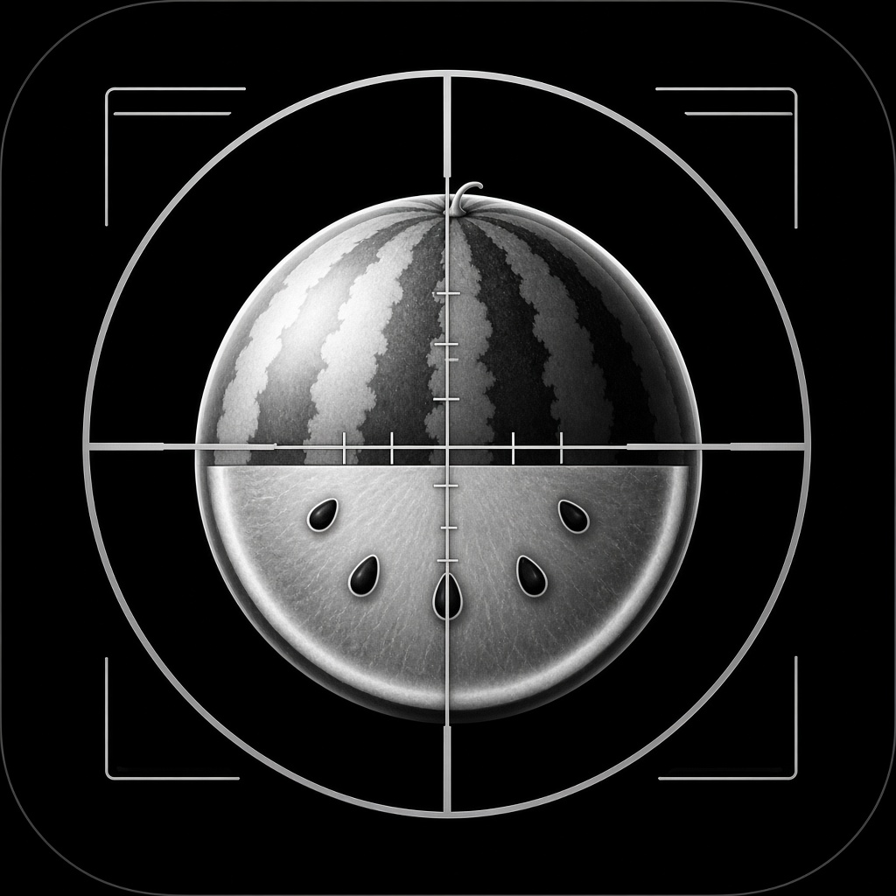

<p align="center">
  
</p>

<h1 align="center">Watermelon Airsoft</h1>

<p align="center">
  <strong>Калькулятор дульной энергии для страйкбола</strong><br/>
  Дж · скорость · вес шара · класс ФССО — прямо на телефоне, без интернета
</p>

<p align="center">
  
  
  
  
  
</p>

---

## Зачем это

Перед хроном нужно быстро понять: **сколько джоулей**, в какой **класс** попадаешь и с какой **дистанции** можно стрелять.  
Не открывать сайт в поле, не ловить мобильный интернет — открыл приложение и крутанул ползунки.

**Watermelon Airsoft** считает энергию локально и показывает регламент ФССО:

| Класс | Лимит | Мин. дистанция |
|-------|-------|----------------|
| Вторичка | ≤ 1.5 Дж | 0 м |
| Основное | ≤ 2.4 Дж | 10 м |
| Снайперка | ≤ 3.0 Дж | 30 м |
| Не допуск | > 3.0 Дж | — |

Формула та же, что у всех нормативных калькуляторов:

```
E = ½ × m × v²
```

Пример: шар **0.25 г** при **120 м/с** → **1.80 Дж** · эквивалент на 0.20 г ≈ **134 м/с**.

---

## Возможности

| | |
|---|---|
| **Калькулятор** | Вес шара (пресеты + слайдер), скорость 80–180 м/с, энергия в Дж |
| **Эквивалент** | Пересчёт скорости на эталонный шар 0.20 г |
| **Регламент** | Подсветка активного класса и минимальной дистанции |
| **Вики** | Формула, зачем джоули, хрон, типичные ошибки, дистанции |
| **Ориентация** | Портрет и ландшафт (две колонки на широком экране) |
| **Офлайн** | Ноль сети: нет API, нет WebView, нет сервера |

UI в стиле Watermelon: тёмный фон `#0c0c0f`, accent `#e84855`, DM Sans. Иконка — абузик в прицеле.

---

## Стек

| | |
|---|---|
| **Клиент** | Expo 53 · React Native · TypeScript · Expo Router |
| **Шрифты** | DM Sans · IBM Plex Mono (числа) |
| **CI** | GitHub Actions → `assembleRelease` → APK в Artifacts |

Один код — Android и iOS. После установки APK приложение работает полностью автономно; на Android из манифеста убраны `INTERNET` и `ACCESS_NETWORK_STATE`.

---

## Быстрый старт

```bash
npm install
npx expo start
```

Дальше `a` — Android, `i` — iOS (нужен Xcode на macOS).

Проверка формулы:

```bash
npm run test:calc
```

---

## APK из GitHub Actions

1. Пуш в `main` / `master` **или** Actions → **Build Android APK** → Run workflow  
2. Дождись зелёного run  
3. Скачай артефакт `watermelon-airsoft-<sha>`

Release в CI подписан debug-keystore — для установки на своё устройство и тестов этого достаточно. Для Google Play добавь свой keystore.

---

## Структура

```
app/                 # экраны (калькулятор, вики, табы)
src/
  components/        # слайдеры, пресеты, hero энергии, классы
  data/wiki.ts       # офлайн-вики
  lib/calculator.ts  # E = ½mv²
  theme/tokens.ts    # палитра Watermelon
assets/              # icon / adaptive / splash
.github/workflows/   # сборка APK
```

---

## Лицензия / заметка

Справочные лимиты — по правилам ФССО. Приложение не связано с сторонними сайтами-калькуляторами: у них взят только смысл расчёта, бренд и UI — **Watermelon**.
