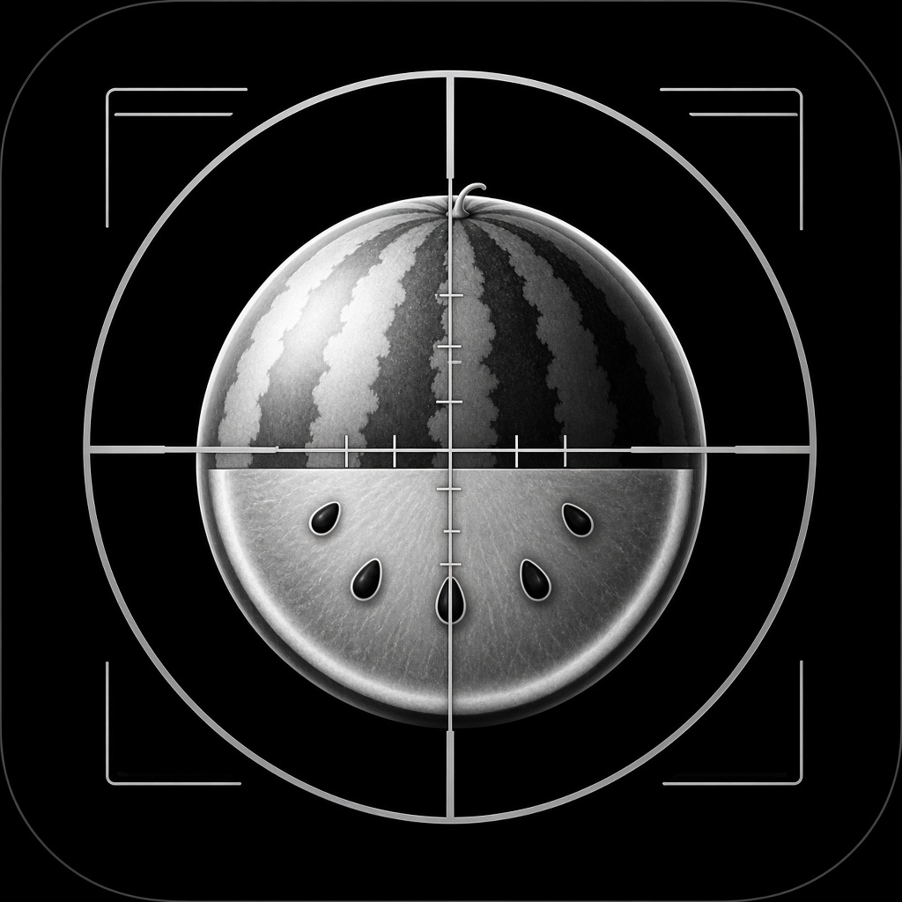

<p align="center">
  
</p>

<h1 align="center">Watermelon Airsoft</h1>

<p align="center">
  Офлайн-калькулятор дульной энергии для страйкбола.<br/>
  ФССО или ЛЕОН — переключил регламент, ввёл вес и скорость, увидел класс.
</p>

<p align="center">
  
  
  
  
</p>

---

## Что делает

Считает дульную энергию по весу шара и скорости, показывает эквивалент на 0.20 г и подсвечивает класс по выбранному регламенту. Результат всегда сверху. Вес и скорость — с клавиатуры, кнопками ± и ползунком.

Всё локально на телефоне, без сервера.

### Формула

```
E = ½ × m × v²
```

Пример: шар **0.25 г** при **120 м/с** → **1.80 Дж** (на 0.20 г ≈ **134 м/с**).

### ФССО (Саратовская область)

| Класс | Лимит |
|-------|-------|
| Здания / близкий контакт | ≤ 1.44 Дж |
| Автомат, открытая местность | ≤ 1.96 Дж |
| Пулемёты | ≤ 2.56 Дж |
| Снайперское (без очередей) | ≤ 2.98 Дж |

В лимиты уже входит погрешность прибора.

### ЛЕОН

| Класс | Лимит |
|-------|-------|
| Пистолет | ≤ 1.44 Дж |
| Автомат | ≤ 1.96 Дж |
| ЛМГ | ≤ 2.25 Дж |
| Пулемёты | ≤ 2.56 Дж |
| Марксман / снайпер | ≤ 2.89 Дж |

---

## Возможности

- Переключатель регламента **ФССО / ЛЕОН**
- Вес шара **0.12–0.50 г**: ввод, ±, ползунок, пресеты
- Скорость **60–200 м/с**
- Подсветка активного класса
- Вики по формуле, хрону и обоим регламентам
- Портрет и ландшафт

---

## Запуск

```bash
npm install
npx expo start
```

`a` — Android, `i` — iOS (Xcode на macOS).

```bash
npm run test:calc
```

---

## Сборка APK

Пуш в `main` / `master` или ручной запуск **Build Android APK** в GitHub Actions. Готовый файл — в Artifacts (`watermelon-airsoft-<sha>`).

Стек: Expo 53, React Native, TypeScript.
